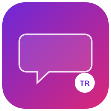

<div align="center">
  

  # GameDub AI

  **Gerçek zamanlı oyun altyazısı yakalama, çeviri ve yapay zekâ dublaj motoru.**

  Ekranındaki İngilizce diyalogları anında okur, çevirir ve karaktere özel
  seslerle Türkçe olarak seslendirir — hiçbir oyun API'sine bağımlı olmadan.

  [](LICENSE)
  
  
  
  [](#katkıda-bulunma)

</div>

---

## Neden GameDub AI?

Türkçe altyazı desteği olmayan binlerce oyun var. Fan-yapımı altyazı yamaları
genelde ya hiç çıkmıyor ya da yıllarca sürüyor. GameDub AI, altyazı beklemek
yerine **ekranı okuyup anında çeviren ve seslendiren** bağımsız bir katman
olmayı hedefliyor — oyunun kodune dokunmadan, tamamen dışarıdan.

```
İngilizce metin
      │
      ▼
   Ekran Yakalama  →  OCR  →  Analiz  →  Çeviri  →  Konuşmacı Tahmini
                                                          │
                                                          ▼
                                              TTS (+ önbellek) → Ses + Overlay
```

## Özellikler

- 🎯 **Tamamen modüler mimari** — her bileşen (`engines/`) tek bir işten
  sorumlu; gerçek motorlar (`plugins/`) tek satır değişiklikle takas edilebilir.
- 🧠 **Akıllı altyazı analizi** — `Hello.`, `HELLO!`, `Hello...` gibi OCR
  gürültüsünü tek bir cümleye indirger, kararlı olmayan kareleri eler.
- 🗣️ **Konuşmacı tahmini** — isim satırı, altyazı rengi veya dönüşümlü
  diyalog varsayımıyla her karaktere kalıcı olarak aynı sesi atar.
- 🔁 **Otomatik yedekleme (fallback) zincirleri** — hem çeviri hem TTS
  sağlayıcıları sırayla denenir; biri başarısız olursa (ör. internet
  kesintisi) sessizce bir sonrakine geçilir.
- ⚡ **Önbellekleme** — aynı cümle tekrar geldiğinde TTS'e gitmez, doğrudan
  önbellekten çalınır.
- 🧩 **Eklenti sistemi** — yeni bir OCR/çeviri/TTS motoru eklemek için
  `plugins/` altına tek bir dosya eklemek yeterli.
- 🚫 **PyTorch yok** — OCR için ONNX Runtime, çeviri için CTranslate2,
  TTS için işletim sistemi motoru veya bulut servisi kullanılır. Ağır GPU
  bağımlılığı ya da dev boyutlu model indirmesi gerekmez.

## Kurulum

```bash
git clone https://github.com/Devtraycat/GameDub-AI.git
cd gamedub-ai

python -m venv venv
source venv/bin/activate      # Windows: venv\Scripts\activate

pip install -r requirements.txt
```

Linux'ta ses çıkışı için ek olarak:

```bash
sudo apt-get install espeak libasound2-dev
```

## Kullanım

1. Oyunu tercihen "borderless windowed" modda açın.
2. `config.py` içindeki `CONFIG.capture.region` değerini, altyazıların
   ekranda çıktığı koordinatlara göre ayarlayın.
3. Çalıştırın:

   ```bash
   python main.py
   ```

İlk çalıştırmada RapidOCR modeli ve Argos Translate'in `en→tr` dil paketi
otomatik iner (tek seferlik, internet gerekir). Sonrasında `argos` +
`pyttsx3` kombinasyonuyla tamamen offline çalışabilir.

## Yapılandırma

Tüm ayarlar `config.py` içinde tek yerde toplanmıştır:

| Ayar | Açıklama | Varsayılan |
|---|---|---|
| `capture.mode` / `region` | Altyazının ekrandaki konumu | `region` |
| `ocr.engine` | `rapidocr` veya `tesseract` | `rapidocr` |
| `translation.engine` | Öncelik sırasına göre sağlayıcı zinciri | `[argos, deepl, google]` |
| `voice.engine` | Öncelik sırasına göre TTS zinciri | `[edge_tts, pyttsx3]` |
| `speaker.color_tolerance` | Renk eşleştirmede izin verilen sapma | `40.0` |

DeepL kullanmak isterseniz `DEEPL_API_KEY` ortam değişkenini tanımlamanız yeterli.

## Yeni bir eklenti eklemek

```
plugins/ocr/benim_ocr_plugin.py
```

içinde `recognize(image) -> list[dict]` metoduna sahip bir `OCRPlugin`
sınıfı tanımlayın, ardından `config.py`'de:

```python
CONFIG.ocr.engine = "benim_ocr"
```

Ana sistemde tek satır bile değişmez — mimarinin tüm amacı bu.

## Yol Haritası

- [x] **v1.0** — Ekran yakalama, RapidOCR, Argos Translate, temel TTS,
      önbellek, temel konuşmacı ayrımı, overlay
- [x] **v1.5** — Renk toleranslı konuşmacı eşleştirme, isim normalizasyonu,
      çoklu TTS/çeviri sağlayıcısı ve otomatik yedekleme zinciri
- [ ] **v2.0** — Oyun profilleri, gerçek zamanlı ses önceliklendirme,
      topluluk eklenti ekosistemi

## Bilinen Sınırlamalar

- Konuşmacı tespiti isim satırı / altyazı rengi / dönüşümlü heuristiğe
  dayanır; görsel karakter tanıma (avatar vb.) kapsam dışıdır.
- `edge_tts` ve `deepl`/`google` sağlayıcıları internet gerektirir; tamamen
  offline çalışmak için `argos` + `pyttsx3` kombinasyonunu kullanın.
- Overlay `tkinter` tabanlıdır; bazı Linux pencere yöneticilerinde
  "always-on-top" davranışı değişebilir.

## Katkıda Bulunma

Katkılar memnuniyetle karşılanır! Yeni bir OCR/çeviri/TTS eklentisi eklemek,
konuşmacı tahmin mantığını geliştirmek ya da hata düzeltmek istiyorsanız:

1. Bu repoyu fork'layın
2. Bir özellik dalı oluşturun (`git checkout -b ozellik/yeni-eklenti`)
3. Değişikliklerinizi commit'leyin
4. Pull request açın

Büyük değişiklikler için önce bir issue açıp tartışmanızı öneririz.

## Lisans

Bu proje [MIT lisansı](LICENSE) ile lisanslanmıştır.

## İletişim

**[DevTrayCat]**
[](https://github.com/kullanici-adi)
[](mailto:iletisim@example.com)

Bir sorun mu buldunuz ya da bir öneriniz mi var? [Issue açın](../../issues) —
her geri bildirim değerlidir.

---

<div align="center">
  <sub>OCR → Çeviri → Dublaj döngüsünü kırmak isteyen oyuncular için ❤️ ile yapıldı.</sub>
</div>
