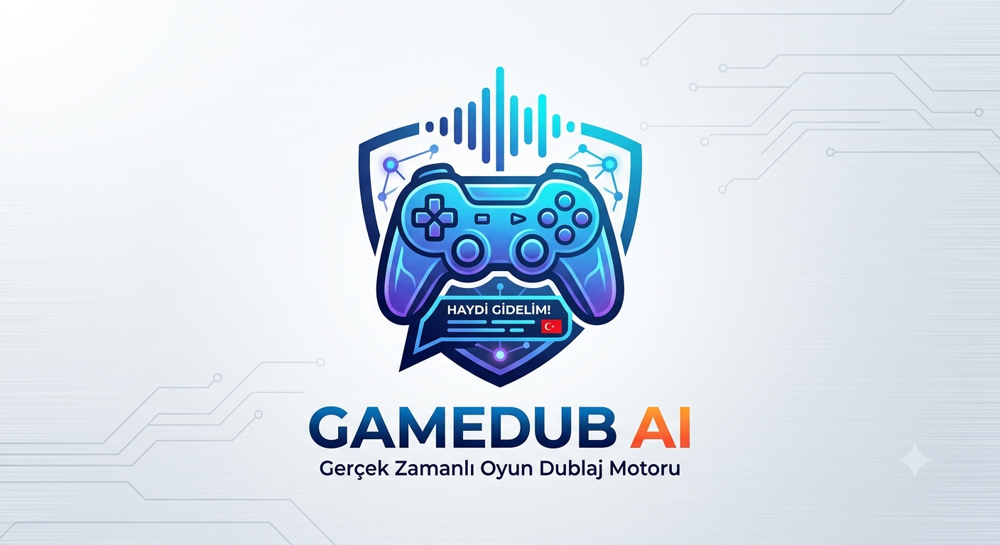

<div align="center">
  

  # GameDub AI

  **Gerçek zamanlı oyun altyazısı yakalama, çeviri ve yapay zekâ dublaj motoru.**

  Ekranındaki İngilizce diyalogları anında okur, çevirir ve karaktere özel
  seslerle Türkçe olarak seslendirir — hiçbir oyun API'sine bağımlı olmadan.

  [](LICENSE)
  
  
  
  [](#katkıda-bulunma)

</div>

---

## Neden GameDub AI?

Türkçe altyazı desteği olmayan binlerce oyun var. Fan-yapımı altyazı yamaları
genelde ya hiç çıkmıyor ya da yıllarca sürüyor. GameDub AI, altyazı beklemek
yerine **ekranı okuyup anında çeviren ve seslendiren** bağımsız bir katman
olmayı hedefliyor — oyunun kodune dokunmadan, tamamen dışarıdan.

```
İngilizce metin
      │
      ▼
   Ekran Yakalama  →  OCR  →  Analiz  →  Çeviri  →  Konuşmacı Tahmini
                                                          │
                                                          ▼
                                              TTS (+ önbellek) → Ses + Overlay
```

## Özellikler

- 🎯 **Tamamen modüler mimari** — her bileşen (`engines/`) tek bir işten
  sorumlu; gerçek motorlar (`plugins/`) tek satır değişiklikle takas edilebilir.
- 🧠 **Akıllı altyazı analizi** — `Hello.`, `HELLO!`, `Hello...` gibi OCR
  gürültüsünü tek bir cümleye indirger, kararlı olmayan kareleri eler.
- 🗣️ **Konuşmacı tahmini** — isim satırı, altyazı rengi veya dönüşümlü
  diyalog varsayımıyla her karaktere kalıcı olarak aynı sesi atar.
- 🔁 **Otomatik yedekleme (fallback) zincirleri** — hem çeviri hem TTS
  sağlayıcıları sırayla denenir; biri başarısız olursa (ör. internet
  kesintisi) sessizce bir sonrakine geçilir.
- ⚡ **Önbellekleme** — aynı cümle tekrar geldiğinde TTS'e gitmez, doğrudan
  önbellekten çalınır.
- 🧩 **Eklenti sistemi** — yeni bir OCR/çeviri/TTS motoru eklemek için
  `plugins/` altına tek bir dosya eklemek yeterli.
- 🚫 **PyTorch yok** — OCR için ONNX Runtime, çeviri için CTranslate2,
  TTS için işletim sistemi motoru veya bulut servisi kullanılır. Ağır GPU
  bağımlılığı ya da dev boyutlu model indirmesi gerekmez.

## Kurulum

```bash
git clone https://github.com/Devtraycat/GameDub-AI.git
cd gamedub-ai

python -m venv venv
source venv/bin/activate      # Windows: venv\Scripts\activate

pip install -r requirements.txt
```

Linux'ta ses çıkışı için ek olarak:

```bash
sudo apt-get install espeak libasound2-dev
```

## Kullanım

1. Oyunu tercihen "borderless windowed" modda açın.
2. `config.py` içindeki `CONFIG.capture.region` değerini, altyazıların
   ekranda çıktığı koordinatlara göre ayarlayın.
3. Çalıştırın:

   ```bash
   python main.py
   ```

İlk çalıştırmada RapidOCR modeli ve Argos Translate'in `en→tr` dil paketi
otomatik iner (tek seferlik, internet gerekir). Sonrasında `argos` +
`pyttsx3` kombinasyonuyla tamamen offline çalışabilir.

## Yapılandırma

### Kontrol Panelinden (v1.6, önerilen)

Uygulamayı çalıştırıp Kontrol Panelindeki **⚙ Ayarlar** butonuna basarak
yakalama, dil/OCR, konuşmacı/ton, ses/overlay ve önbellek ayarlarının
tamamını arayüzden değiştirebilirsiniz. Değişiklikler hem anında canlı
uygulanır hem de `runtime_settings.json` içine kalıcı kaydedilir (bir
sonraki açılışta hatırlanır). Yeni bir ayar eklemek isteyen geliştiriciler
için: `config.py:SETTINGS_SCHEMA` listesine tek satır eklemek yeterlidir,
Ayarlar penceresi buradan otomatik üretilir.

### `config.py` üzerinden (kod içi varsayılanlar)

| Ayar | Açıklama | Varsayılan |
|---|---|---|
| `capture.mode` / `region` | Altyazının ekrandaki konumu | `region` |
| `capture.skip_unchanged` | Değişmeyen kareyi OCR'den geçirme (hız) | `True` |
| `ocr.engine` | `rapidocr` veya `tesseract` | `rapidocr` |
| `ocr.lang` | `en` veya `tr` (Türkçe altyazı yakalama) | `en` |
| `translation.engine` | Öncelik sırasına göre sağlayıcı zinciri | `[argos, deepl, google]` |
| `translation.direct_tts` | Çeviriyi atla, OCR metnini doğrudan seslendir | `False` |
| `analyzer.name_pattern` | "İsim: replik" yakalama deseni (regex) | bkz. `config.py` |
| `voice.engine` | Öncelik sırasına göre TTS zinciri | `[edge_tts, pyttsx3]` |
| `speaker.color_tolerance` | Renk eşleştirmede izin verilen sapma | `40.0` |

DeepL kullanmak isterseniz `DEEPL_API_KEY` ortam değişkenini tanımlamanız yeterli.

### Türkçe altyazılı oyunlar için doğrudan seslendirme

Bazı oyunlarda İngilizce yerine zaten Türkçe altyazı vardır; bu durumda
çeviriye gerek yoktur, doğrudan Türkçe metni seslendirmek yeterlidir.
Ayarlar penceresinden ya da `config.py`'de:

```python
CONFIG.ocr.lang = "tr"
CONFIG.ocr.engine = "tesseract"       # Türkçe karakter seti için önerilir
CONFIG.translation.direct_tts = True  # çeviri adımını tamamen atla
```

**Neden `tesseract`?** RapidOCR'ın varsayılan tanıma modeli İngilizce +
Çince karakter setine göre eğitilmiştir; ç, ğ, ı, ö, ş, ü, İ gibi Türkçeye
özgü karakterleri düzgün tanımaz (en yakın Latin harfe indirger ya da
atlar). Tesseract'ın `tur` dil paketi bu karakterleri tam kapsar:

```bash
sudo apt-get install tesseract-ocr-tur   # Linux
# Windows: Tesseract kurulumunda "Turkish" dil paketini işaretleyin
pip install pytesseract opencv-python
```

### Performans (v1.6)

Eski sürümde yakalama -> OCR -> çeviri -> TTS tek bir thread'de sıralı
çalışıyordu; çeviri/TTS'in ağ gecikmesi (1-3 sn) doğrudan ekran
yakalamayı da bloklayıp genel sistemi yavaşlatıyordu. v1.6'da:

- Yakalama+OCR ve çeviri+TTS artık **iki ayrı thread'de**, bir kuyruk
  üzerinden haberleşerek çalışıyor - biri ne kadar yavaş olursa olsun
  diğeri asla beklemiyor.
- Değişmeyen kare artık OCR'ye hiç gönderilmiyor (`capture.skip_unchanged`).
- Aynı cümle tekrar geldiğinde artık çeviri sağlayıcısına da gidilmiyor
  (eskiden yalnızca TTS sesi önbellekleniyordu, çeviri her seferinde
  tekrar yapılıyordu).

### v1.7 - acil düzeltmeler

Kullanıcı geri bildirimiyle bulunan 4 gerçek hata:

1. **"Türkçe karakterler İngilizce gibi okunuyor"** — RapidOCR'ın gömülü
   tanıma sözlüğü ç/ğ/ı/ö/ş/ü/İ karakterlerini hiç içermiyor. `ocr.lang`
   "tr" seçilse bile motor "rapidocr" bırakılmışsa yanlış sonuç
   alınıyordu. Artık `lang="tr"` olduğunda motor **otomatik olarak
   `tesseract`'a zorlanıyor** (bkz. `engines/ocr_engine.py`).
2. **"Küçük / arka planı olmayan beyaz yazı hiç algılanmıyor"** — bunun
   iki ayrı kök nedeni vardı ve ikisi de düzeltildi:
   - "Değişmeyen kareyi atla" optimizasyonu TÜM bölgenin **ortalama**
     farkına bakıyordu; küçük bir altyazı bu ortalamayı yeterince
     değiştirmediği için kare "aynı" sanılıp OCR hiç çalıştırılmıyordu.
     Artık bölge bir **grid**'e bölünüp en çok değişen hücreye bakılıyor
     (`capture.diff_grid`, `capture.change_threshold`) - küçük bir metin
     bloğu bile artık doğru şekilde "değişti" sayılıyor.
   - OCR'ye verilmeden önce görüntü artık **2x büyütülüp kontrastı
     güçlendiriliyor** (CLAHE) - ince/küçük/arka plansız fontların
     tanınma oranını belirgin şekilde artırır (`ocr.enhance_contrast`).
3. **"Algılandıktan sonra sese dönene kadar yavaş / diyaloğa yetişemiyor"**
   — üç ayrı gerçek performans hatası:
   - `pyttsx3` eklentisi **her tek replikte** işletim sistemi TTS motorunu
     (SAPI5/espeak) sıfırdan başlatıyordu - bu tek başına yüzlerce ms -
     saniyeler sürebiliyordu. Artık motor bir kez kurulup önbelleğe alınıyor.
   - Birincil TTS motoru artık **Piper** — tamamen yerel/offline, ~60MB,
     ONNX tabanlı, CPU'da gerçek zamanlıdan çok daha hızlı çalışan bir
     Türkçe motor (`plugins/tts/piper_plugin.py`). edge_tts'in ağ
     gecikmesi ve pyttsx3'ün zayıf Türkçe kalitesi artık sadece yedek
     durumda devreye giriyor.
   - Piper modelleri artık uygulama açılışında **arka planda önceden
     yükleniyor** (`VoiceEngine.preload()`), böylece ilk gerçek replikte
     model indirme/yükleme gecikmesi yaşanmıyor.
4. **"Ayarlar menüsünde Kaydet çalışmıyor"** — buton aslında çalışıyordu
   ama sekme içeriği (özellikle yeni eklenen ayarlarla) pencere
   boyutundan taşınca buton satırı görünür alanın dışına itiliyor ve
   erişilemez hale geliyordu. Artık buton satırı pencereye **önce ve
   sabit** ekleniyor (her zaman görünür), her sekme kaydırılabilir hale
   getirildi ve kaydetme sonrası açık bir "✓ Kaydedildi" onay penceresi
   gösteriliyor.

## Yeni bir eklenti eklemek

```
plugins/ocr/benim_ocr_plugin.py
```

içinde `recognize(image) -> list[dict]` metoduna sahip bir `OCRPlugin`
sınıfı tanımlayın, ardından `config.py`'de:

```python
CONFIG.ocr.engine = "benim_ocr"
```

Ana sistemde tek satır bile değişmez — mimarinin tüm amacı bu.

## Yol Haritası

- [x] **v1.0** — Ekran yakalama, RapidOCR, Argos Translate, temel TTS,
      önbellek, temel konuşmacı ayrımı, overlay
- [x] **v1.5** — Renk toleranslı konuşmacı eşleştirme, isim normalizasyonu,
      çoklu TTS/çeviri sağlayıcısı ve otomatik yedekleme zinciri
- [x] **v1.6** — Kontrol Panelinden tam ayar yönetimi (⚙ Ayarlar), Türkçe
      altyazılı oyunlar için doğrudan TTS + Türkçe karakter destekli OCR,
      isim etiketini metnin herhangi bir yerinde yakalayan konuşmacı/ton
      tespiti, yakalama+OCR ile çeviri+TTS'in ayrı thread'lere ayrılması ve
      çeviri önbellekleme (büyük hız/gecikme iyileştirmesi)
- [x] **v1.7** — Yerel Piper TTS motoru (küçük, hızlı, offline Türkçe),
      Türkçe OCR'ın otomatik doğru motora zorlanması, küçük/arka plansız
      altyazıların artık kaçırılmaması (grid tabanlı değişim algılama +
      kontrast güçlendirme), pyttsx3'ün her replikte motoru yeniden
      başlatma hatasının giderilmesi, Ayarlar penceresindeki gizli
      "Kaydet" butonu düzeltmesi
- [ ] **v2.0** — Oyun profilleri, gerçek zamanlı ses önceliklendirme,
      topluluk eklenti ekosistemi

## Bilinen Sınırlamalar

- Konuşmacı tespiti isim satırı / altyazı rengi / dönüşümlü heuristiğe
  dayanır; görsel karakter tanıma (avatar vb.) kapsam dışıdır.
- `edge_tts` ve `deepl`/`google` sağlayıcıları internet gerektirir; tamamen
  offline çalışmak için `argos` + `pyttsx3` kombinasyonunu kullanın.
- Overlay `tkinter` tabanlıdır; bazı Linux pencere yöneticilerinde
  "always-on-top" davranışı değişebilir.
- Ses çalma `sounddevice` (PortAudio) ile yapılır; Linux'ta PortAudio'nun
  sistemde kurulu olması gerekir (`sudo apt-get install libportaudio2`),
  aksi halde replikler sessizce atlanır ve hata log'a yazılır (uygulama
  çökmez).

## Katkıda Bulunma

Katkılar memnuniyetle karşılanır! Yeni bir OCR/çeviri/TTS eklentisi eklemek,
konuşmacı tahmin mantığını geliştirmek ya da hata düzeltmek istiyorsanız:

1. Bu repoyu fork'layın
2. Bir özellik dalı oluşturun (`git checkout -b ozellik/yeni-eklenti`)
3. Değişikliklerinizi commit'leyin
4. Pull request açın

Büyük değişiklikler için önce bir issue açıp tartışmanızı öneririz.

## Lisans

Bu proje [MIT lisansı](LICENSE) ile lisanslanmıştır.

## İletişim

**Dev Tray Cat**
[](https://github.com/Devtraycat(https://github.com/Devtrayca))
[](mailto:batuhangurdu@gmail.com)

Bir sorun mu buldunuz ya da bir öneriniz mi var? [Issue açın](../../issues) —
her geri bildirim değerlidir.

---

<div align="center">
  <sub>Oyunlarda dil briyerini kırmak isteyen oyuncular için ❤️ ile yapıldı.</sub>
</div>
